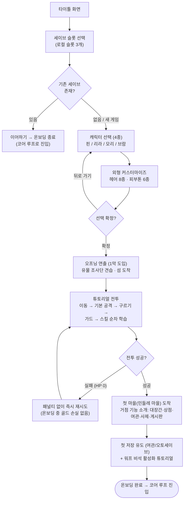
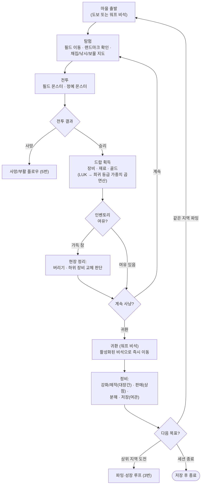
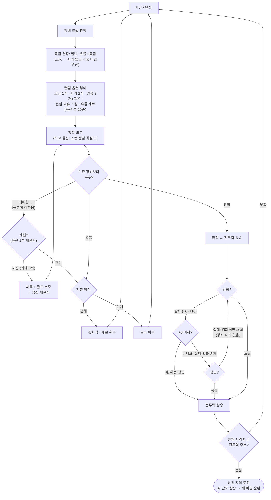
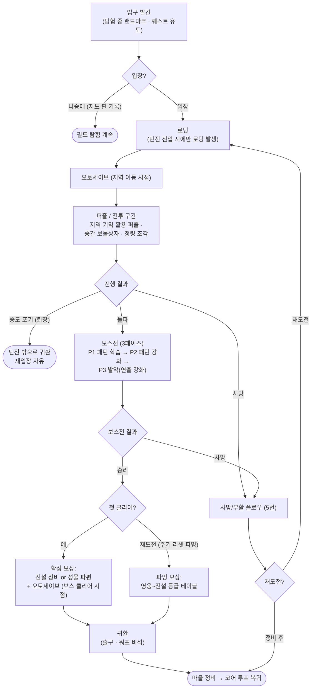
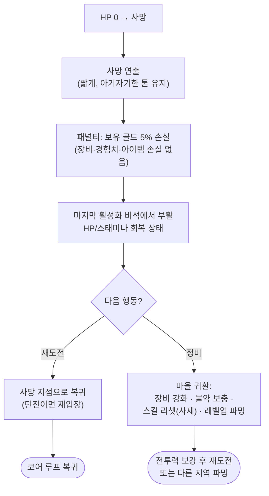
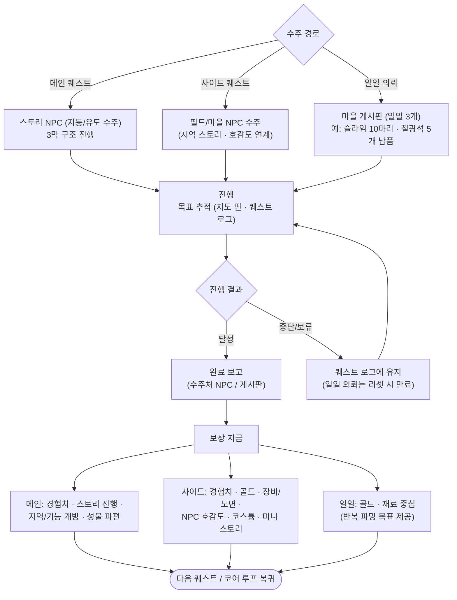
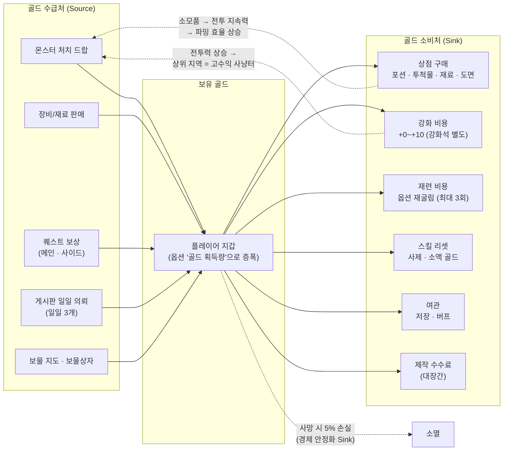

# BRD — 유저 플로우 정의서

> 《이슬란드 연대기 (Chronicles of Isleland)》
> 기준 문서: `docs/GDD-도트액션RPG-기획안.md` (v1.0, 2026-08-17)
> 문서 버전: v1.0 (2026-08-17) / 담당: 시스템 기획
> 표기 원칙: GDD에 명시된 수치만 사용. GDD에 없는 수치는 **미정(밸런싱 단계 결정)** 으로 표기.

---

## 목차

1. [신규 유저 온보딩 플로우](#1-신규-유저-온보딩-플로우)
2. [코어 게임 루프 (15분 루프)](#2-코어-게임-루프-15분-루프)
3. [파밍·성장 루프](#3-파밍성장-루프)
4. [던전 공략 플로우](#4-던전-공략-플로우)
5. [사망/부활 플로우](#5-사망부활-플로우)
6. [퀘스트 플로우](#6-퀘스트-플로우)
7. [상점/경제 순환 플로우](#7-상점경제-순환-플로우)

---

## 1. 신규 유저 온보딩 플로우

첫 실행부터 첫 거점 마을(민들레 마을) 도착까지. 목표: 이탈 없이 "전투 손맛 + 파밍 첫 보상"을 최단 시간 내 체험시킨다.

### 단계별 정의

| 단계 | 진입 조건 | 분기 조건 | 이탈 지점 | 실패 케이스 |
|---|---|---|---|---|
| 타이틀 → 슬롯 선택 | 게임 실행 | 기존 세이브 유무 | 실행 직후 종료(최대 이탈 구간) | 세이브 파일 손상 → 손상 안내 + 해당 슬롯만 격리, 다른 슬롯 영향 없음 |
| 캐릭터 선택·커스터마이즈 | 빈 슬롯에서 새 게임 | 캐릭터 4종 중 택1, 뒤로 가기 허용 | 선택 화면에서 결정 피로로 이탈 | 확정 전 앱 종료 → 슬롯 미생성(재진입 시 처음부터) |
| 오프닝 (1막 도입) | 캐릭터 확정 | 없음(선형) | 컷신 길이로 인한 지루함 | 스킵 기능 필수(도트 연출 위주, 긴 컷신 지양 — GDD 2.3) |
| 튜토리얼 전투 | 오프닝 종료 | 조작 학습 완료 여부 | 난이도 좌절 이탈 | HP 0 → 패널티 없이 즉시 재시도 (골드 5% 손실 규칙은 온보딩 중 비적용) |
| 첫 마을 도착 | 튜토리얼 전투 클리어 | 없음 | 마을 기능 과다 안내로 인한 정보 과부하 | 저장 전 종료 → 오토세이브(지역 이동 시점)로 복구 |

- 온보딩 목표 소요 시간: **미정(밸런싱 단계 결정)** — 벤치마크 상 15~20분 내 권장.
- 커스터마이즈 항목은 GDD 3장 명시 범위(헤어 8종·피부톤 6종)만 노출. 코스튬은 파밍 획득이므로 온보딩에서 미노출.

### 설계 노트
- 첫 "재미 순간"(기본 공격 히트스톱·타격감)까지 실행 후 3분 이내 도달을 목표로 한다. 타이틀~전투 사이 모든 화면은 스킵/뒤로가기를 지원한다.
- 온보딩 중에는 사망 패널티(골드 5%)를 적용하지 않는다 — 학습 구간에서 실패는 무비용이어야 한다.
- 첫 마을 도착 직후 반드시 첫 장비 드랍 또는 첫 퀘스트 보상 1회를 보장해 "파밍 게임"이라는 정체성을 각인시킨다(구체 보상: 미정, 밸런싱 단계 결정).

---

## 2. 코어 게임 루프 (15분 루프)

GDD 1.2의 "15분 단위 짧은 루프(사냥→보상)"를 화면 단위로 구체화한 것. 이 루프의 완결성이 리텐션의 핵심이다.

### 단계별 정의

| 단계 | 진입 조건 | 분기 조건 | 이탈 지점 | 실패 케이스 |
|---|---|---|---|---|
| 마을 출발 | 정비 완료(또는 생략) | 워프 비석 활성화 여부(미활성 시 도보) | 목적지 불명확으로 인한 방황 | 워프 미개방 지역 → 도보 이동 강제 |
| 탐험 | 필드 진입 | 랜드마크·채집물·보물 지도 발견 | 이동 시간 지루함 | 시야 랜드마크 부재 시 목표 상실(GDD 7.3 원칙 위반) |
| 전투 | 몬스터 조우 | 승리/사망/도주 | 전투 회피 누적 → 루프 붕괴 | 사망 → 플로우 5번 분기 |
| 드랍 획득 | 몬스터 처치 | 등급 판정(LUK 곱연산) | 드랍 체감 부족 시 루프 동기 상실 | 인벤토리 가득 참 → 현장 정리 강제 |
| 귀환 | 유저 판단(인벤/HP/목표 달성) | 워프 vs 도보 | 귀환 동선이 길면 세션 이탈 | 귀환 전 사망 → 골드 5% 손실 |
| 정비 | 마을 도착 | 강화/판매/분해/저장 선택 | 정비 메뉴 복잡도 | 저장 없이 종료 → 오토세이브 시점까지 롤백 |

### 설계 노트
- **루프당 보상 최소 1회**: 15분 루프 1회에 "체감 보상"(장비 드랍, 레벨업, 도감 등록, 정령 조각 중 1개 이상)이 반드시 발생해야 한다. 기대 드랍량 수치는 미정(밸런싱 단계 결정).
- **이탈 지점 최소화**: 귀환~재출발 사이 화면 전환을 3회 이하로 유지한다(워프 → 정비 → 재출발). 워프 비석은 파밍 반복 동선 단축이 존재 이유다(GDD 7.3).
- 인벤토리 가득 참은 "짜증"이 아니라 "분해 보상"으로 전환한다(GDD 6.4) — 현장 정리 UI에서 분해 예상 획득량을 표시한다.

---

## 3. 파밍·성장 루프

전투력의 60%가 장비에서 나오는 설계(GDD 5.3)에 따라, 장비 의사결정 트리를 명시한다.

### 단계별 정의

| 단계 | 진입 조건 | 분기 조건 | 이탈 지점 | 실패 케이스 |
|---|---|---|---|---|
| 드랍 판정 | 몬스터 처치·상자 개봉 | 콘텐츠 소스별 등급 상한(GDD 6.5 표) | 드랍 기대 미충족 반복 시 파밍 동기 상실 | — (판정은 항상 성공, 등급 분포만 변동) |
| 장착 비교 | 장비 획득 | 비교 툴팁 스탯 증감 | 비교 UI가 불편하면 인벤토리에 방치 | 옵션 가치 판단 불가(옵션 설명 부족) |
| 재련 | 재료+골드 보유, 잔여 횟수 1~3회 | 재굴림 결과 만족 여부 | 3회 소진 후 미련 이탈 | 재굴림 결과가 더 나쁨(하한 보호 여부: 미정, 밸런싱 단계 결정) |
| 강화 | 강화석 보유 | +6 이하 확정 / +7부터 확률 | 연속 실패 스트레스 | 실패 시 강화석만 소실, 장비 파괴·등급 하락 없음(GDD 6.4 고정) |
| 분해/판매 | 미사용 장비 보유 | 강화석·재료 필요 여부 vs 골드 필요 여부 | — | 실수 분해 방지 장치(잠금 기능: 미정, UX 단계 결정) |
| 상위 지역 도전 | 전투력 충분 판단 | 지역 난도 ★1~★4 | 전투력 판단 기준 부재 시 벽 체감 | 도전 실패 → 사망 플로우, 현 지역 파밍으로 회귀 |

- 강화 확률(+7 이상), 강화/재련 비용, 등급별 드랍 가중치, LUK 곱연산 계수: **미정(밸런싱 단계 결정)** — `game/data/` 테이블로 별도 산출 예정.

### 설계 노트
- "열등한 드랍"도 반드시 출구가 2개(분해/판매) 있어 무가치 드랍이 존재하지 않게 한다 — 모든 드랍은 최소한 재료 또는 골드다.
- 재련 3회 제한은 "극한 파밍과 적당한 타협"의 균형 장치(GDD 6.3)이므로, 제한 해제 아이템 등으로 우회로를 만들지 않는다.
- 상위 지역 도전 판단을 돕는 전투력 가이드(권장 레벨/전투력 표시)는 필요하나 강제 입장 제한은 두지 않는다 — 오픈월드 자유 공략 원칙(GDD 2.2, 2막 자유 순서) 유지.

---

## 4. 던전 공략 플로우

지역 던전(30~40분, 퍼즐+보스, 재입장 자유) 기준. 미니 던전(5~10분)은 보스전 단계가 없는 축약형으로 동일 골격을 따른다.

### 단계별 정의

| 단계 | 진입 조건 | 분기 조건 | 이탈 지점 | 실패 케이스 |
|---|---|---|---|---|
| 입구 발견 | 해당 지역 탐험 | 즉시 입장 vs 지도 핀 기록 | 발견 후 위치를 잊어버림(핀 찍기로 방지) | — |
| 입장(로딩) | 유저 입장 선택 | 없음 | 로딩 시간 과다 | 입장 조건(랜턴·방한복·내화 장비 등 지역 기믹 아이템) 미충족 → 진행 불가 안내 |
| 퍼즐/전투 구간 | 로딩 완료 | 돌파/사망/중도 포기 | 퍼즐 막힘(힌트 부재) | 사망 → 플로우 5번. 퍼즐 리셋 범위: 미정(레벨 디자인 단계 결정) |
| 보스전 (3페이즈) | 구간 돌파 | 페이즈 전환(HP 임계값: 미정) | 페이즈 반복 학습 피로 | 사망 → 플로우 5번. 보스방 앞 체크포인트 여부: 미정(레벨 디자인 단계 결정) |
| 보상 | 보스 처치 | 첫 클리어 vs 재도전 | — | 인벤토리 가득 참 시 보상 수령 처리: 미정(UX 단계 결정) |
| 귀환 | 보상 수령 | 출구 도보 vs 워프 | 귀환 동선 길이 | — |

- 던전 사망 시 던전 내부 진행도(개방한 문·푼 퍼즐)의 유지/리셋 범위: **미정(레벨 디자인 단계 결정)**. 아래 5번 플로우의 공백 사항과 연동.

### 설계 노트
- 재입장 자유(GDD 6.5)이므로 "중도 포기"는 실패가 아니라 유효한 전략이어야 한다 — 중도 획득 보상(상자·정령 조각)은 퇴장해도 유지한다.
- 보스전 직전에는 반드시 준비 확인 지점(포션·장비 점검 유도)을 둔다. 3페이즈 학습 곡선상 1회차 사망은 정상 설계이므로, 재도전 동선(부활 비석 → 보스방)을 짧게 유지한다.
- 첫 클리어 확정 보상(전설 or 성물 파편)은 절대 랜덤화하지 않는다 — 던전 1회차는 "확정 성장"으로, 재도전은 "확률 파밍"으로 역할을 분리한다(GDD 8.2).

---

## 5. 사망/부활 플로우

GDD 11장: "죽으면 골드 5% 손실 후 마지막 비석에서 부활 (하드코어 아님, 캐주얼 지향)".

### 단계별 정의

| 단계 | 진입 조건 | 분기 조건 | 이탈 지점 | 실패 케이스 |
|---|---|---|---|---|
| 사망 | HP 0 | 없음 | 연속 사망으로 인한 세션 이탈(최대 위험 지점) | — |
| 골드 5% 손실 | 사망 확정 | 없음(고정 비율) | 골드 손실 체감이 과하면 이탈 | 보유 골드 0일 때 → 손실 0 (음수 없음) |
| 비석 부활 | 패널티 적용 완료 | 마지막 활성화 비석 위치 | 부활 지점이 사망 지점과 멀면 재도전 포기 | 해당 지역 비석 미활성 시 부활 위치 규칙: 미정(레벨 디자인 단계 결정 — 인접 지역 비석 또는 거점 마을 제안) |
| 재도전/정비 분기 | 부활 완료 | 유저 판단(전투력·소모품 상태) | 정비 선택 후 복귀 동선이 길면 이탈 | — |

- 온보딩(플로우 1) 구간에서는 골드 손실 패널티 비적용.
- 사망 시 필드 드랍(시체 회수) 메커니즘은 **없음** — 캐주얼 지향 원칙상 골드 5% 외 추가 패널티를 두지 않는다.

### 설계 노트
- 사망은 "벌"이 아니라 "정비 신호"다. 부활 직후 화면에서 정비 선택지(마을 워프)를 1버튼으로 제공해, 벽에 막힌 유저를 파밍 루프(성장 우회로)로 자연스럽게 유도한다.
- 사망 → 재도전까지의 시간을 최소화한다(연출 스킵 가능, 목표 시간: 미정). 재도전 비용이 높으면 "읽고 피하는 전투"(GDD 4.2)의 학습 사이클이 무너진다.
- 골드 5%는 상한/하한 없는 고정 비율(GDD 명시)이므로, 후반 골드 인플레이션 시 체감 패널티가 커지는 문제는 경제 밸런싱 단계에서 재검토한다(7번 플로우 참조).

---

## 6. 퀘스트 플로우

### 유형별 차이

| 구분 | 메인 퀘스트 | 사이드 퀘스트 | 일일 의뢰(게시판) |
|---|---|---|---|
| 수주처 | 스토리 NPC(자동 유도) | 필드/마을 NPC | 마을 게시판 |
| 수량 | 3막 고정 시나리오 | 지역별 고정 물량 | **일일 3개** (GDD 7.4) |
| 진입 조건 | 이전 막 진행도 (2막은 5개 성물 자유 순서) | 지역 도달, 일부는 호감도/시간대 조건 | 거점 마을 게시판 개방 |
| 반복 여부 | 1회성 | 1회성 (히든 퀘스트 포함) | 일일 리셋 반복 |
| 핵심 보상 | 스토리·지역 개방·성물 파편·(히든: 전설 장비) | 호감도·코스튬·미니 스토리·도면 | 골드·재료 (경제 순환의 수급처) |
| 실패 케이스 | 실패 없음(재시도 가능) | NPC 사망 등 실패 조건 없음(캐주얼 톤) | 리셋 시각 도래 시 미완료분 만료 |

- 일일 의뢰 리셋 시각, 의뢰별 보상 수치: **미정(밸런싱 단계 결정)**.
- 퀘스트 동시 수주 상한: **미정(UX 단계 결정)**.

### 단계별 정의 (공통)

| 단계 | 진입 조건 | 분기 조건 | 이탈 지점 | 실패 케이스 |
|---|---|---|---|---|
| 수주 | 유형별 진입 조건 충족 | 유형 3종 | 게시판/NPC 위치 인지 실패 | 일일 3개 초과 수주 불가 |
| 진행 | 수주 완료 | 목표 달성 여부 | 목표 위치 추적 실패(핀·로그로 방지) | 대상 몬스터/재료 위치 모름 → 지도 힌트 제공 |
| 완료 보고 | 목표 달성 | 없음 | 보고하러 돌아가는 동선 부담 | 보고 전 일일 리셋 → 처리 규칙 미정(밸런싱 단계 결정) |
| 보상 | 보고 완료 | 유형별 보상 테이블 | — | 인벤토리 가득 참 시 지급 처리: 미정(UX 단계 결정) |

### 설계 노트
- 일일 의뢰는 "오늘 15분 루프의 목적지"를 제공하는 장치다 — 의뢰 목표는 반드시 기존 파밍 동선 위에 놓아, 의뢰 수행이 곧 파밍이 되게 한다.
- 완료 보고 동선은 워프 비석 인접 배치로 최소화한다. "잡으러 갔다 → 보고하러 돌아온다"가 루프당 1회 이상의 왕복을 만들지 않게 한다.
- 메인 퀘스트에는 실패 상태를 두지 않는다(캐주얼 지향). 사이드 퀘스트도 시간 제한·NPC 사망 같은 영구 실패 조건을 두지 않는다.

---

## 7. 상점/경제 순환 플로우

골드의 수급처(Source)와 소비처(Sink) 순환도. 목표: 골드가 "남아도는 숫자"가 아니라 항상 다음 성장 의사결정의 자원이 되게 한다.

### 순환 정의

| 요소 | 진입 조건 | 분기 조건 | 이탈 지점 | 실패 케이스 |
|---|---|---|---|---|
| 수급 (Source 5종) | 코어 루프 수행 | 골드 획득량 옵션·호감도 할인 보유 여부 | 수급이 소비를 크게 초과하면 골드 무가치화(인플레이션) | — |
| 상점 구매 | 마을 상점 이용 | NPC 호감도 → 할인 | 살 것이 없는 상점(재고 매력 부족) | 골드 부족 → 구매 불가 안내 |
| 강화/재련/제작 | 대장간 이용, 재료 보유 | 성공/실패(강화 +7 이상) | 비용 대비 효율 불신 | 골드·재료 부족, 재련 3회 소진 |
| 스킬 리셋 | 사제 NPC | 없음 | — | 골드 부족. "소액" 원칙(GDD 4.3) — 빌드 실험을 막지 않는 가격이어야 함 |
| 여관 | 마을 여관 | 저장 vs 버프 | — | 여관 이용 요금 유무: 미정(밸런싱 단계 결정 — GDD는 기능만 명시) |
| 사망 손실 | 사망 | 없음(5% 고정) | — | 골드 0 보유 시 손실 없음 |

- 상점 가격표, 강화/재련/제작 비용, 스킬 리셋 비용, 여관 요금, 수급처별 골드 기대값: 전부 **미정(밸런싱 단계 결정)** — `game/data/economy.*` 테이블로 산출 예정.

### 설계 노트
- Sink 총량이 Source 총량을 장기적으로 약간 상회하도록 설계한다(사망 5% 손실 + 강화 반복 비용이 핵심 조절 밸브). 얼리액세스 지표 수집으로 보정한다(GDD 14장).
- 스킬 리셋만은 예외적으로 "싸게" 유지한다 — 이 Sink의 목적은 골드 회수가 아니라 빌드 실험 장려다(GDD 4.3). 골드 회수는 강화·재련이 담당한다.
- 모든 소비처는 마을 한 곳에 모여 있으므로(GDD 7.4 거점 구조), 귀환 1회 = 소비 의사결정 1세트가 되도록 마을 동선(대장간·상점·여관·사제·게시판)을 인접 배치한다.

---

## 부록 — GDD 대비 공백/모순 사항

> **[2026-09-08 확정]** 아래 G1~G9는 모두 `04-decisions.md`에서 확정되어 GDD v1.1에 반영되었다.
> G1→D-26, G2→D-27, G3→D-28, G4→D-29, G5→D-30, G6→D-20/D-21, G7→D-25, G8→D-10, G9→D-31.
> 본문 중 "미정"으로 표기된 수치는 결정 문서와 GDD v1.1을 우선한다.

본 문서 작성 중 발견한 항목. GDD 수정 또는 후속 스펙 문서에서 해소 필요.

| # | 구분 | 내용 | 제안 |
|---|---|---|---|
| G1 | 공백 | 온보딩 순서: GDD 2.2 1막은 "섬 도착 → 첫 마을 습격 → 성물 반응"인데, 튜토리얼 전투와 첫 마을 도착의 선후 관계가 미기술. 본 문서는 "오프닝 → 튜토리얼 전투 → 첫 마을 도착" 순서로 정의했으며, 습격 이벤트를 튜토리얼 전투로 겸하는 해석을 제안 | GDD 2.2에 1막 시퀀스(도착→습격=튜토리얼→마을 확보) 1줄 추가 |
| G2 | 공백 | 던전 내 사망 시 던전 진행도(퍼즐·개방 문) 유지/리셋 규칙 없음. 보스방 앞 체크포인트 유무도 미기술 | 레벨 디자인 스펙에서 결정. 재입장 자유 원칙과 일관되게 "구간 체크포인트 유지" 권장 |
| G3 | 공백 | 부활 기준 "마지막 비석"이 워프 비석과 동일 오브젝트인지, 미활성 지역에서 사망 시 부활 위치 규칙 없음 | 워프 비석 = 부활 비석 통합 권장(오브젝트·튜토리얼 단순화) |
| G4 | 공백 | 여관 저장·버프의 과금(골드) 여부 미기술. 경제 Sink 설계에 영향 | 버프는 유료, 저장은 무료 권장(저장에 비용을 물리면 캐주얼 지향과 충돌) |
| G5 | 공백 | 메인/사이드 퀘스트 시스템 구조가 GDD에 명시적 장(章)으로 없음(지역 스토리·히든 퀘스트 언급만 산재) | GDD에 퀘스트 시스템 절 추가 또는 본 문서 6번을 준거로 승격 |
| G6 | 공백 | 일일 의뢰 리셋 시각, 완료 보고 전 리셋 도래 시 처리 규칙 없음 | 밸런싱 단계에서 리셋 시각과 함께 "수주분은 리셋 후에도 보고 가능" 여부 결정 |
| G7 | 잠재 모순 | 사망 골드 5% 손실(고정 비율)은 후반 골드 보유량 증가 시 절대 손실액이 급증 — "하드코어 아님" 톤과 충돌 가능 | 경제 밸런싱 단계에서 손실 상한(cap) 도입 여부 검토, 필요 시 GDD 11장 수정안 제출 |
| G8 | 공백 | 인벤토리 슬롯 수, 가득 참 상태에서의 보상(던전 확정 보상·퀘스트 보상) 지급 규칙 없음 | UX 스펙에서 결정. 확정 보상은 우편/임시 보관 등 유실 방지 장치 권장 |
| G9 | 공백 | 브람의 "필드 간이 수리"(GDD 3장) 기능의 전제인 장비 내구도 시스템이 GDD 어디에도 정의되지 않음 | 내구도 시스템 도입 여부 결정 필요. 미도입 시 브람 고유 기능을 "필드 간이 제작"(GDD 6.4의 서술)으로 통일 권장 |
