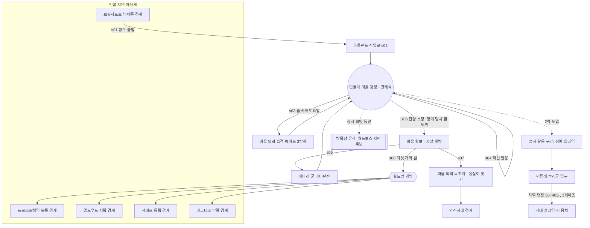
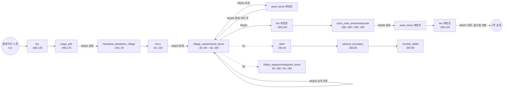

# 레벨 디자인 — 하틀랜드 (Heartland, 중앙 초원)

> 기준 문서: GDD 7장(오픈월드 & 맵 디자인)·8.1(몬스터 설계 기준), `docs/brd/03-features/04-오픈월드-탐험.md`(F4-1~F4-4),
> 결정 D-28(비석=워프/부활 동일 오브젝트)·D-34(지도 핀 8종·최대 30개)·D-38(거점 마을 명칭=민들레 마을)·
> D-42(이동속도 5타일/s, 25분은 실제 경로 기준)·D-58(예정, `drop_table_id` null 허용 — `combat-tuning-m1-addendum.md` §6-2),
> 세계관 바이블(`stage/story-02-world-story`) 1.1·3.3·3.4·5.1장, 메인 스토리라인 1막(s01~s08)·2막 3.1(하틀랜드),
> `docs/specs/combat-tuning-m1.md` §8-3, `docs/art/art-bible.md` §3(하틀랜드 32색 팔레트).
>
> GDD·바이블에 수치가 없는 항목은 본문에 **"제안"**으로 표기한다. 이 문서는 설계 문서이며, 실제 `.ldtk`/`.tmx` 파일과
> `game/data/spawns/hartland.json`은 이 문서를 근거로 별도 태스크(godot-engineer 협의)에서 작성한다 — 이번 세션은
> `docs/levels/hartland.md` 작성까지만 수행한다(다른 에이전트가 `game/` 작업 중이므로 `game/` 미수정).

---

## ① 지역 개요

| 항목 | 내용 |
|---|---|
| 지방명 | 하틀랜드 (Heartland) — 고어로 "땅의 심장", 다섯 지방 중 지리적 중심이자 최초 정착지 (바이블 5.1) |
| 거점 마을 | **민들레 마을** (D-38) |
| 기후·지형 | 온화, 완만한 구릉과 초지. 낮은 언덕에 초가지붕 집들이 둥글게 모인 마을 |
| 난이도 | **★1** (GDD 7.1 지도 — 시작 지역, 5개 지방 중 최저 난도) |
| 지역 기믹 | 없음 (`region_hazards.json` 해당 없음 — 온화한 기후, F4-4 기믹 목록에 하틀랜드 없음) |
| 지역 보스 | 거대 슬라임 킹 '뭉치' — **지역 던전 '민들레 뿌리굴'** 내부(2막 3.1). 필드에 상시 존재하지 않음 |
| 지역 크기(제안) | **6×6 청크 (384×384 타일)** — GDD 7.1 "약 400×400 타일×5개 지방"을 64타일 청크 단위로 반올림. 실제 도보 체감은 D-42에 따라 직선거리가 아니라 구릉·농장 울타리·습지 우회로 확보(청크 내부 장애물 배치로 달성) |
| 인접 이음새 (방위는 바이블 1.1 기준) | 북=프로스트헤임(체감 9분), 서=엘드우드(7분), 동=사마르(8분), 남=이그니스(10분), 남서=브릿지포트(6분). **5개 방위 모두에 이음새가 필요한 유일한 지역** — 하틀랜드가 다섯 지방의 지리적 중심이기 때문 |
| 안전지대 원칙 | 바이블 1.1: 마을 결계석이 지키는 좁은 안전지대 밖은 몬스터 밀도·안개 연출로 "여긴 남의 땅"이라는 낯섦을 준다. 하틀랜드는 남서쪽 습지(민들레 뿌리굴 방면)에서 이 낯섦을 처음 체감시킨다 |

---

## ② 청크 격자 개략도 + 동선도

### ASCII 청크 격자 (6×6, 열=서→동 C1~C6, 행=북→남 R1~R6)

```
        C1                C2              C3                  C4              C5                    C6
R1  [숲경계 능선]      [초원 언덕]    [초원─북쪽 갈림길]   [목자 전망대]    [초원]              [초원─사마르 조망]
R2  [→엘드우드 경계]   [초원 목장]    [→프로스트헤임 경계] [초원]           [메아리 굴 언덕]      [초원]
R3  [→엘드우드 경계]   [농장 외곽]    [민들레 마을★]       [목초지]         [정예캠프:고블린]     [→사마르 경계]
R4  [습지 초입]        [습지]         [습지 깊은 곳:       [개활지]         [풍차 언덕]           [초원]
                                       민들레 뿌리굴 입구]
R5  [습지:정예 슬라임]  [개활지]       [개활지]             [방목장 유적:    [그을린 초지]         [→이그니스 경계]
                                                            월드보스 제단]
R6  [→브릿지포트 경계]  [해안 저지대]  [개활지]             [개활지]         [그을린 구릉]         [→이그니스 경계]
```

- ★ = 민들레 마을(중심, C3R3). 마을이 정중앙보다 살짝 북쪽에 있어 남쪽(습지→뿌리굴, 남/남서 국경)에 여유 공간을 확보했다.
- 북쪽(R1~R2)은 완만한 구릉으로 프로스트헤임 설산으로 서서히 고도가 높아지는 전이 지형, 서쪽(C1)은 나무가 점점 빽빽해지며 엘드우드 안개로 이어지는 전이 지형, 동쪽(C6)은 풀이 마르고 아지랑이가 보이며 사마르로 이어지는 전이 지형, 남쪽(R6)은 두 갈래(남서=해안 저지대→브릿지포트, 남동=그을린 구릉→이그니스)로 갈라진다.

### mermaid 동선도 (주요 POI·게이트 관계)



- 1막 동선은 항상 마을 광장으로 되돌아오는 별 모양(허브 스포크) 구조 — 튜토리얼 단계에서 플레이어가 길을 잃지 않도록 모든 이벤트가 광장에서 시작·종료된다.
- 2막(뭉치) 동선은 습지를 거쳐 뿌리굴로 진입하는 별도 남서쪽 지선으로, 1막 동선과 물리적으로 겹치지 않게 배치해 "이제 다른 이야기가 시작된다"는 감각을 준다.

---

## ③ 시야 랜드마크 체크리스트

원칙: 화면 320×180 월드px ≈ 20×11 타일(16px 프로토타입 기준, `art-bible.md` §1.1) 안에 플레이어 위치와 무관하게
"가보고 싶은 것" 1개 이상이 보여야 한다(GDD 7.3). 하틀랜드는 평지 초원이라 원경(스카이라인) 랜드마크의 비중이 높다 —
근경 랜드마크가 없는 개활지 칸도 인접 지방의 실루엣으로 커버한다.

### 랜드마크 목록 (12개)

| # | 이름 | 종류 | 위치(청크) | 비고 |
|---|---|---|---|---|
| L1 | 민들레 결계석 | 근경, 지역 상징 | C3R3(중심) | 마을 광장, 발광 이펙트(s04) |
| L2 | 목자 전망대 | 근경 | C4R1 | 나무 파수대, 민들레제(축제) 배경 |
| L3 | 프로스트헤임 설산 봉우리 | 원경 스카이라인 | 북쪽 화면 밖(R1 상단에서 항상 보임) | 진입 불가, 눈 덮인 봉우리 실루엣 |
| L4 | 엘드우드 안개 능선 | 원경 스카이라인 | 서쪽(C1 좌측 화면 밖) | 짙어지는 안개 그라데이션으로 방향성 암시 |
| L5 | 사마르 사구 아지랑이 | 원경 스카이라인 | 동쪽(C6 우측 화면 밖) | 낮 시간대 아지랑이 셰이더(제안) |
| L6 | 이그니스 화산 연기기둥 | 원경 스카이라인 | 남쪽(R6 하단 화면 밖) | 상시 옅은 연기, 밤에는 붉은 빛 반사(제안) |
| L7 | 브릿지포트 등대 불빛 | 원경 스카이라인 | 남서쪽(C1R6 좌하단 화면 밖) | 노을·밤에만 점등(제안, 낮/밤 시스템과 연동) |
| L8 | 메아리 굴 입구 (반딧불 이끼 동굴) | 근경 | C5R2 | 야간엔 이끼 발광으로 더 잘 보임 |
| L9 | 민들레 뿌리굴 입구 (고사목 뿌리 아치) | 근경 | C3R4 | 습지 안개 속에서도 뿌리 아치 실루엣은 크게 보이도록 스케일업 |
| L10 | 낡은 풍차 | 근경 | C5R4 | 필러 랜드마크, 개활지 시야 확보용 |
| L11 | 방목장 유적 (월드보스 제단) | 근경 | C4R5 | 폐허 헛간 실루엣 + 제단 발광(대기 중 아이콘, F6-3) |
| L12 | 정예 캠프 (부서진 마차) | 근경 | C5R3 | 고블린 정찰대장 진지, 연기 피어오름 |

### 청크별 점검 (36칸, 근경=해당 칸에서 직접 보이는 랜드마크 / 원경=스카이라인으로 커버)

| 청크 | 지형 | 확보된 랜드마크 |
|---|---|---|
| C1R1 | 숲경계 능선 | 원경 L4(엘드우드) |
| C2R1 | 초원 언덕 | 원경 L3(설산), 근경 L2 방향 |
| C3R1 | 초원(북쪽 갈림길) | 원경 L3(설산, 정면) |
| C4R1 | 목자 전망대 | 근경 L2 |
| C5R1 | 초원 | 원경 L3(설산) |
| C6R1 | 초원(사마르 조망) | 원경 L3, 원경 L5(사마르) |
| C1R2 | 엘드우드 경계 | 근경 L4(안개 능선 바로 앞) |
| C2R2 | 초원 목장 | 근경 L1(결계석, 원경) |
| C3R2 | 프로스트헤임 경계 | 원경 L3(정면 확대) |
| C4R2 | 초원 | 근경 L8(메아리 굴 언덕) |
| C5R2 | 메아리 굴 언덕 | 근경 L8 |
| C6R2 | 초원 | 원경 L5(사마르) |
| C1R3 | 엘드우드 경계 | 근경 L4 |
| C2R3 | 농장 외곽 | 근경 L1(결계석) |
| C3R3 | 민들레 마을 | 근경 L1(중심) |
| C4R3 | 목초지 | 근경 L1, 근경 L12 |
| C5R3 | 정예 캠프 | 근경 L12 |
| C6R3 | 사마르 경계 | 원경 L5 |
| C1R4 | 습지 초입 | 근경 L9(뿌리굴 아치, 원경) |
| C2R4 | 습지 | 근경 L9 |
| C3R4 | 뿌리굴 입구 | 근경 L9(정면) |
| C4R4 | 개활지 | 근경 L10(풍차) |
| C5R4 | 풍차 언덕 | 근경 L10 |
| C6R4 | 초원 | 원경 L5, 원경 L6(이그니스) |
| C1R5 | 습지(정예 슬라임) | 근경 L9(원경) |
| C2R5 | 개활지 | 근경 L11(방목장, 원경) |
| C3R5 | 개활지 | 근경 L11 |
| C4R5 | 방목장 유적 | 근경 L11(정면) |
| C5R5 | 그을린 초지 | 원경 L6(이그니스) |
| C6R5 | 이그니스 경계 | 원경 L6(정면 확대) |
| C1R6 | 브릿지포트 경계 | 원경 L7(등대) |
| C2R6 | 해안 저지대 | 원경 L7 |
| C3R6 | 개활지 | 근경 L11(원경) |
| C4R6 | 개활지 | 원경 L6 |
| C5R6 | 그을린 구릉 | 원경 L6 |
| C6R6 | 이그니스 경계 | 원경 L6(정면) |

결과: 36칸 전부 최소 1개 이상의 랜드마크가 근경 또는 원경 스카이라인으로 확보됨. 원경 랜드마크(L3~L7)는 5개 인접 지방
전부를 커버해, 하틀랜드 어디서든 "저기 다른 지방이 있다"는 방향 감각을 준다(D-42가 요구하는 "실제 경로 기준" 탐험 동기와 직결).

---

## ④ 민들레 마을 배치

마을은 청크 **C3R3**(타일 X128~191, Y128~191) 안에 배치한다. 좌표는 해당 청크 로컬 타일 좌표(청크 원점 기준 0~63)로 표기한다.

### 로컬 배치 ASCII (청크 C3R3 내부, 0~63 타일)

```
                         북(프로스트헤임 방면)
                    ┌───────────────────────────┐
                    │        [여관:머루]          │
                    │   [핀토 대장간 견습]         │
      서(엘드우드) ← │ [대장간]  [결계석·비석]  [상점] │ → 동(정예캠프/사마르)
                    │   [미용실]  [게시판][우편함] │
                    │        [사제 오두막]         │
                    │      (로젤의 목장 방향)       │
                    └───────────────────────────┘
                         남(습지·뿌리굴 방면)
```

### 좌표 목록 (청크 C3R3 로컬 타일, 전역 타일 = 청크원점(128,128) + 로컬)

| 시설/NPC | 로컬 좌표 | 전역 타일 좌표 | 비고 |
|---|---|---|---|
| 결계석 (비석: 워프+부활, D-28) | (32,32) | (160,160) | 마을 중심, s04 발광 이벤트 지점 |
| 대장간 | (24,28) | (152,156) | 강화/제작/재련/분해 |
| 상점 | (40,28) | (168,156) | 잡화·소모품 |
| 여관 (머루 할머니) | (32,20) | (160,148) | 저장 무료/숙박 유료(D-29) |
| 사제 오두막 | (44,36) | (172,164) | 스킬·스탯 리셋 |
| 미용실 | (20,38) | (148,166) | 외형 변경 |
| 우편함 | (34,30) | (162,158) | 광장 옆, 2막 "테오의 우편" 재사용 지점 |
| 게시판 | (30,30) | (158,158) | 일일 의뢰 3종 |
| 로젤의 집·목장 | (52,22) | (180,150) | 동쪽, 목초지 방향 |
| 핀토(대장간 견습생) | (26,26) | (154,154) | 대장간 인접 |
| 다미(1회성 NPC, s07) | 마을 외곽 목초지 C4R3 (198,150) 부근 | — | "몽실이를 찾아서" 시작점 |

### 1막 습격 튜토리얼 동선 (D-26, main_a1_s03~s05)

1. **s02 도입**: 플레이어는 남서쪽 진입로(C2R3→C3R3)로 마을에 들어와 광장을 먼저 본다(평화로운 인상, 전투 없음).
2. **s03 습격**: 광장(160,160) 도달 직후 트리거. 안개에 물든 약체 몬스터가 마을 외곽 3방향에서 등장해 광장으로 수렴한다.
   - 웨이브 A(북, 공격 튜토리얼): (160,140) 부근, 1~2마리
   - 웨이브 B(동, 구르기 튜토리얼): (176,158) 부근, 1마리 — 돌진형 유도
   - 웨이브 C(남, 가드 튜토리얼): (158,178) 부근, 1마리
   - 총 3~4마리, GDD 요구(공격 3콤보→구르기→가드 순차 입력)를 웨이브 순서로 강제한다.
3. **s04 파편 반응**: 웨이브 소탕 후 광장 결계석(160,160) 앞에서 자동 컷신(스킵 가능).
4. **s05 마을 확보**: 정예 "덩치 뿔토끼"(습격 잔당 우두머리, 1회성 스토리 스폰)가 마을 동쪽 헛간 부근 (182,152)에서 등장 → 첫 정예 전투 → 클리어 시 마을 시설(대장간·상점·여관·게시판 등) 개방 + 구간 오토세이브.

---

## ⑤ 스폰 존

### 필드 일반 몬스터 (GDD 8.1 초원 예시: 방울 슬라임/뿔토끼/버섯돌이/고블린 정찰병)

값은 `combat-tuning-m1.md` §8, `combat-tuning-m1-addendum.md` §4-3(AI 공통 필드) 확정치를 그대로 참조한다. 밀도·좌표 범위는 **제안**(레벨 디자인 신규).

| 스폰 존 ID | 몬스터 | 좌표 범위(전역 타일) | 밀도(청크당 `max_concurrent`) | 리스폰 | 난이도 근거 |
|---|---|---|---|---|---|
| spawn_slime_village_south | 방울 슬라임 | C3R4~C4R4, X192~255 Y192~255 | 4 | 상시(0s, `farming_sources.json` field) | 마을 남쪽 저난도 완충지대, 튜토리얼 이후 저강도 파밍 |
| spawn_slime_farm_west | 방울 슬라임 | C2R3, X64~127 Y128~191 | 3 | 상시 | 농장 외곽, 저난도 |
| spawn_rabbit_open_field | 뿔토끼 | C4R3~C4R4, X192~255 Y128~255 | 4 | 상시 | 개활지, 돌진 공간 확보(aggro 80px 대비 여유 필요) |
| spawn_rabbit_east_plain | 뿔토끼 | C5R1~C6R2, X256~383 Y0~127 | 4 | 상시 | 동쪽 초원, 사마르 접경 전 난도 상승 구간 |
| spawn_mushroom_windmill | 버섯돌이 | C5R4, X256~319 Y192~255 | 3 | 상시 | 풍차 언덕 그늘, 정지형이라 그늘·습기 지형 선호 |
| spawn_mushroom_marsh_edge | 버섯돌이 | C2R4, X64~127 Y192~255 | 3 | 상시 | 습지 인접, 눅눅한 지형 콘셉트 일치 |
| spawn_goblin_scout_border | 고블린 정찰병 | C5R3, X256~319 Y128~191 | 3 | 상시 | GDD 8.1 예시 4종 중 유일한 원거리 경보형, 정예 캠프(L12) 인근 배치로 "증원 호출" 기믹이 실제로 증원(주변 뿔토끼/슬라임)을 부르도록 설계 |

- 낮/밤 스폰(`weather.json`/`spawns.json` F4-3): 하틀랜드는 야간 전용 몬스터를 M1 범위에서 별도 정의하지 않음(제안 — 필요 시 추후 확장, `spawn_list_night`는 스키마만 선반영).

### 정예 몬스터 2종 (GDD 8.1, 일반 몬스터 강화 변종)

| 정예 ID | 베이스 골격 | 이름 | 위치 | 리스폰 | 강화 패턴(제안) |
|---|---|---|---|---|---|
| elite_goblin_captain | 고블린 정찰병 | 고블린 정찰대장 | C5R3, (296,152) 부서진 마차(L12) | 1800s(30분, F6-3) | 호루라기 범위 확대 + 소환 웨이브 1회 추가 |
| elite_bunchi_spawn | 방울 슬라임 | 뭉치의 새끼 (분열체) | C1R5 습지, (24,272) | 1800s(30분) | 스토리 2막(3.1) "안전지대 밖 습지" 갈등 단계 전투와 동일 개체 재사용. 필드 상시 정예로도 리스폰(2막 완료 후 파밍 대상) |

- 1회성 스토리 정예(s05 "덩치 뿔토끼")는 위 상시 리스폰 목록에 포함하지 않는다 — 별도 퀘스트 트리거 스폰.

### 월드 보스 제단 후보 (F6-3, 3일 리스폰)

| 항목 | 내용 |
|---|---|
| 위치 | C4R5 방목장 유적(L11), 전역 타일 (256,288) 부근 |
| 후보 몬스터(제안) | **"듬직이"** — 옛 방목장의 늙은 밭갈이 소가 안개에 물들어 거대화한 개체. 바이블 5.1 금기("안개에 닿아 변한 옛 가축을 괴물이라 부르지 않는다")와 정합되는 명명 |
| 리스폰 | 259200s(3일, `farming_sources.json`) |
| 보상 | 전설 1개 확정(F6-3) |
| 비고 | 방목장 유적은 폐허 헛간 + 낡은 울타리로 시야를 가려, 대기 중에는 제단 아이콘만 보이다가(GDD 7.3 월드맵 리스폰 아이콘) 활성화 시 헛간 앞 개활지가 보스 아레나로 쓰이도록 여유 공간(반경 약 12타일) 확보 |

### `game/data/spawns/hartland.json` 스키마 초안 (제안, 예시 발췌 — 실제 파일 생성은 godot-engineer 협의 후)

`docs/specs/data_tables.md` §22(`spawns.json`) 포맷을 청크 단위로 따르되, 정예·월드보스는 `farming_sources.json`(§11)이
소유하는 리스폰 개념을 좌표와 함께 연결하기 위해 `elite_spawns`/`world_boss_altar` 확장 키를 제안한다(스키마 확정은
game-designer·godot-engineer 협의 필요, D-58 예정 — `drop_table_id`는 `null` 허용).

```json
{
  "_comment": "제안 초안. chunk_id 표기는 HL_C<col>R<row> (LDtk 레벨 식별자와 1:1 일치시킬 것을 제안, ⑨ 참고).",
  "region_id": "hartland",
  "chunks": {
    "HL_C4R3": {
      "region_id": "hartland",
      "spawn_list_day": [
        { "monster_id": "horn_rabbit", "weight": 1.0 }
      ],
      "spawn_list_night": [],
      "max_concurrent": 4,
      "gathering_nodes": []
    },
    "HL_C5R2": {
      "region_id": "hartland",
      "spawn_list_day": [],
      "spawn_list_night": [],
      "max_concurrent": 0,
      "gathering_nodes": [
        { "item_id": "spirit_shard", "pos_local": [40, 20] }
      ]
    }
  },
  "elite_spawns": [
    {
      "elite_id": "elite_goblin_captain",
      "base_monster_id": "goblin_scout",
      "chunk_id": "HL_C5R3",
      "pos_global_tile": [296, 152],
      "respawn_seconds": 1800,
      "drop_table_id": null
    }
  ],
  "world_boss_altar": {
    "altar_id": "world_boss_hartland",
    "candidate_monster_id": "corrupted_ox_deumjigi",
    "chunk_id": "HL_C4R5",
    "pos_global_tile": [256, 288],
    "respawn_seconds": 259200,
    "drop_table_id": null
  }
}
```

---

## ⑥ 수집물

### 정령 조각 (바이블 3.3, GDD 5.3 — 4개 모으면 HP/스태미나 영구 +1칸)

총 **12개(제안, 3세트 분량)** 배분 — 난이도별 접근성 차등:

| 난이도 | 개수 | 배치 위치(제안) |
|---|---|---|
| 쉬움(마을 인근) | 4 | 광장 화단(160,166), 대장간 뒤뜰(150,160), 목자 전망대 계단 밑(198,54), 로젤의 목장 울타리 밑(182,148) |
| 보통(개활지·풍차) | 4 | 풍차 날개 그늘(258,196), 정예 캠프 마차 바퀴 밑(300,158), 동쪽 초원 바위틈(340,60), 농장 허수아비 밑(70,150) |
| 어려움(습지·경계) | 4 | 뿌리굴 입구 고사목 구멍(160,196, L9), 습지 정예 캠프 근처 갈대숲(20,268), 이그니스 경계 그을린 바위(360,296), 브릿지포트 경계 해안 안개 속(10,340) |

메아리 굴(미니 던전) 내부 정령 조각은 ⑦절 보물상자와 별도로 1개 추가 배치 가능(제안, GDD 6.5 "미니 던전 보상: 보물상자·정령 조각"과 합치).

### 보물 지도 목표 지점 (몬스터 드랍, GDD 6.5)

| 지점명 | 위치 | 비고 |
|---|---|---|
| 낡은 우물 터 | C2R3, (100,150) 농장 외곽 | 지도 드랍 시 X 표시, 파서 보물 획득 |
| 무너진 물레방아 | C1R4, (30,210) 습지 초입 | 습지 테마와 연동(가라앉은 수레바퀴) |

### 낚시 포인트

| 지점명 | 위치 | 비고 |
|---|---|---|
| 마을 연못 | 광장 남쪽, (162,172) | 상시 접근 가능, 초심자용 어종 |
| 습지 개울 | C2R4, (90,220) | 비 오는 날 전용 어종(F4-3) 후보 |

### 채집 포인트 (요리 재료)

| 종류 | 위치(제안) |
|---|---|
| 들꽃·허브 | R1~R2 개활지 전반(다수, 밀도 낮게 산포) |
| 버섯(식용) | C2R4·C5R4 버섯돌이 스폰 존 인접(몬스터와 별개 채집 노드) |
| 나무열매·장작 | C1 열(엘드우드 경계 숲) |

---

## ⑦ 메아리 굴 (미니 던전, 5~10분, main_a1_s06)

**위치**: C5R2, 마을에서 도보 약 1~2분 거리(진입로는 마을 광장 동북쪽에서 시작). 테오는 입구까지만 동행하고 대기한다.

### 구간 구성 (3구간)

| 구간 | 이름 | 목적 | 소요(제안) |
|---|---|---|---|
| 1 | 반딧불 통로 | 이동/카메라 재확인 + 약체 몬스터 1~2마리(스킬 슬롯 사용 유도) | 1~2분 |
| 2 | 빛무리 퍼즐방 | 퍼즐 1 (아래) | 2~4분 |
| 3 | 보물의 방 | 보물상자 1개 + 정령 조각(선택) + 체크포인트 비석 | 1~2분 |

### 퍼즐 1 (제안): "빛무리 징검다리"

발광 버섯 눌림판 3개가 방 안에 흩어져 있다. 각 눌림판은 밝기가 다르며, 반딧불형 발광 이끼가 벽을 따라 정답 순서(어두운 것→밝은 것)를 은은하게 암시한다(연출 문서 "가독성 우선" 원칙, main_a1_s06). 순서대로 밟으면 안쪽 문이 열린다 — 틀리면 눌림판이 전부 꺼지고 처음부터 다시 시도(패널티 없음, 시간 제한 없음). 스킬 포인트 첫 획득처를 이 구간 클리어 보상으로 배치한다(main_a1_s06 게임플레이 훅).

### 체크포인트 비석 (D-27 원칙 적용)

- 3구간 입구(퍼즐방 통과 직후, 보물의 방 앞)에 비석 1개 배치. D-28에 따라 워프/부활 겸용 오브젝트와 동일 종류이나, 던전 내부 전용이라 월드맵 워프 목적지로는 노출하지 않는다(제안 — 던전 내부 워프 취급은 godot-engineer·game-designer 협의 필요).
- 사망 시 이 비석에서 재개, 퍼즐 진행 상태(문이 열린 상태)는 유지된다(D-27 "구간 진행도는 사망 후에도 유지" 원칙을 미니 던전에도 동일 적용).
- 메아리 굴은 보스방이 없어 D-27의 "보스방 앞 필수" 요건 대상은 아니지만, 퍼즐→보상 사이 체크포인트를 두는 편이 일관된 사용자 경험을 준다고 판단해 제안한다.

---

## ⑧ M1 게이트용 테스트 아레나 사양

목적: M1 몬스터 3종(방울 슬라임/뿔토끼/버섯돌이)의 HP/공격력/이동속도/예고시간(`combat-tuning-m1.md` §8) 실측 검증을
위한 **독립 테스트 씬**. 오픈월드 청크 스트리밍과 무관하게 godot-engineer가 즉시 별도 씬으로 만들 수 있도록 사양을 좁힌다.

| 항목 | 사양 |
|---|---|
| 크기 | 24×16 타일 (384×256px @16px 프로토타입) — 화면(20×11타일)보다 약간 커서 몬스터별 인지범위(최대 96px=6타일)·leash(최대 180px≈11타일) 테스트에 여유 확보 |
| 지형 | 평지, 충돌 없음(내부는 완전 개활지) |
| 장애물 | 바위 4개(2×2타일 크기, 시야 차단·카이팅 테스트용): (8,4), (8,12), (16,4), (16,12) — 중앙 통로는 비워 뿔토끼 돌진 테스트 공간 확보 |
| 플레이어 스폰 | (2,8) 서쪽 끝 |
| 슬라임 스폰(3) | (10,4), (10,8), (10,12) |
| 뿔토끼 스폰(2) | (18,6), (18,10) — 돌진(200px/s·0.3s) 사거리 확보를 위해 개활지 중앙 배치 |
| 버섯돌이 스폰(2) | (22,5), (22,11) — 장판(`aoe_radius_px`=32px≈2타일)이 벽에 닿지 않게 동쪽 벽에서 2타일 이격 |
| 리셋 방식(제안) | 씬 재시작 트리거(디버그 키) 또는 GUT 테스트 훅에서 씬 reload — UI는 최소(HP바만) |
| 데이터 소스 | `game/data/monsters.json`(hp/atk/속도/예고), `game/scripts/tuning.gd`(AI 공통 5필드) 그대로 참조, 이 씬 전용 하드코딩 금지 |
| LDtk 편입 여부 | M1 단계는 별도 `.tscn`(비-LDtk)로 두는 것을 제안 — 검증 완료 후 ⑨의 `hartland.ldtk`에 `Test_Arena` 레벨로 동일 배치를 이식해 회귀 테스트용으로 보존 가능 |

---

## ⑨ LDtk 프로젝트 구조 제안

| 항목 | 제안 |
|---|---|
| 파일 위치 | `game/maps/hartland/hartland.ldtk` (지역별 폴더 분리 — 다른 4개 지방도 동일 패턴) |
| 기본 그리드 크기 | 16px (M1 프로토타입, `art-bible.md` §1.1 예외 규정 준수). 최종 아트 전환 시 32px로 일괄 재설정(같은 문서 5.2 참고) |
| World 레이아웃 | LDtk "GridVania" 모드, 셀 크기 = 64타일(=1024px@16px) — 청크 경계(F4-1)와 1:1 일치 |
| 레벨(Level) 단위 | 청크 1개 = 레벨 1개. 식별자 `HL_C<col>R<row>` (예: 마을=`HL_C3R3`, 메아리 굴 입구가 있는 칸=`HL_C5R2`). ⑤의 `game/data/spawns/hartland.json`의 `chunk_id`와 동일 문자열을 사용해 로더가 1:1 매핑하도록 한다(`data_tables.md` §22 검증 규칙: "chunk_id 청크 좌표계와 game/maps/ 청크 파일 명명 규칙 일치") |
| 레이어 구성(하→상) | 1) `IntGrid_Collision`(0=없음/1=고체/2=수면/3=습지 감속) 2) `Tiles_Ground`(잔디/흙길/습지/사구 전이 오토타일) 3) `Tiles_Detail`(꽃·바위·울타리 등 비충돌 장식) 4) `Tiles_Structures`(마을 건물 외곽) 5) `Entities`(아래) |
| Entities 필드 정의(제안) | `MonsterSpawn`{monster_id:string, weight:float, day_only:bool, night_only:bool}, `EliteSpawn`{elite_id, base_monster_id, respawn_seconds}, `WorldBossAltar`{altar_id, candidate_monster_id}, `NPC`{npc_id}, `WarpShrine`(D-28), `MapPin`{pin_type: enum(보물/몬스터/채집/낚시/NPC/던전/위험/메모) — D-34 8종과 동일 enum}, `CollectibleSpirit`, `GatherNode`{item_id}, `FishingSpot`, `TreasureMapTarget`, `DungeonEntrance`{dungeon_id} |
| 스폰 데이터 동기화(제안) | `Entities` 레이어의 `MonsterSpawn`류를 단일 진실 소스로 삼고, 임포트 후처리 스크립트(`game/addons/ldtk-importer/post-import/`)가 이를 읽어 ⑤의 `game/data/spawns/hartland.json` 구조로 내보내는 방식을 제안 — 이중 수기 관리(LDtk + JSON 별도 작성) 방지. 최종 채택 여부는 godot-engineer와 협의 필요(현재는 두 개를 손으로 맞추는 방식도 대안으로 유효) |
| 메아리 굴·민들레 뿌리굴 | 오픈월드 청크와 별도 LDtk 프로젝트(`game/maps/dungeons/echo_cave.ldtk`, `game/maps/dungeons/dandelion_root_cave.ldtk`)로 분리 — GDD 7.1 "던전 진입 시에만 로딩" 원칙과 정합 |
| Godot 임포트 확인 사항(godot-engineer 몫, 체크리스트만 제공) | ① `game/addons/ldtk-importer` 최신 버전에서 GridVania 월드 임포트 지원 확인 ② 16px 그리드·Nearest 필터·밉맵 끔 임포트 설정(art-bible §1) ③ IntGrid 콜리전이 Godot TileMap 물리 레이어로 정상 변환되는지 ④ Entities 커스텀 필드가 GDScript에서 읽히는지 샘플 1개 청크로 우선 검증 후 36개 전체 제작 |

---

## ⑩ 퀘스트 배치 (M2-8)

> 기준: `docs/story/quests-act1-hartland.md`(메인 7개·사이드 5개), `game/data/quests/act1_hartland.json`
> (`_todo_ids.locations` 7개·`.objects` 5개·목표 target `npc:dami/meru/pinto/rozel/teo`),
> `docs/specs/quest-system-m2.md`(Events 시그널 계약). 실제 좌표·id는 `game/data/world_objects.json`
> (신설, 이 문서가 근거)에 두고 `scripts/world/quest_layout_spawner.gd`(Main.tscn의
> `HartlandQuestLayer` 노드 1개)가 읽어 인스턴스화한다.
>
> **좌표계 주의**: 이 절의 좌표는 ②~⑨절이 쓰는 384×384 타일 6×6 청크 격자(전역 타일
> 좌표)가 **아니다**. `game/scenes/main/Main.tscn`은 아직 청크 스트리밍이 없는 단일
> 프로토타입 씬(`scripts/systems/world.gd`가 채우는 64×64 타일 풀밭 한 장, 월드
> 원점 기준 px)이라, 이 절의 좌표는 그 프로토타입 씬의 px 좌표다 — 청크 격자 좌표로의
> 정식 이식은 LDtk 맵 제작(⑨절) 시점에 함께 수행한다(그때 world_objects.json의
> `position`도 `pos_global_tile`(⑤절 스키마)로 재작성).

### 배치 씬 3종

| 씬 | 스크립트 | 대응 kind | 상호작용 시그널 |
|---|---|---|---|
| `scenes/world/QuestTrigger.tscn` | `quest_trigger.gd` | `location` | `Events.location_reached(location_id)` |
| `scenes/world/QuestObject.tscn` | `quest_object.gd` | `object` | `Events.object_interacted(object_id)` |
| `scenes/world/QuestNpc.tscn` | `quest_npc.gd` | `npc` | `Events.npc_talked(npc_id)` + HUD 토스트(`npc.<id>.greeting`) |

### 좌표표 (`game/data/world_objects.json`, 17건)

| id | kind | 좌표(px) | 대응 랜드마크/방위(②~⑨절 기준) | 비고 |
|---|---|---|---|---|
| `bridgeport_dock` | location | (-380, 160) | 브릿지포트 방면 이음새(남서) | MQ01 시작점 |
| `cargo_pile` | object | (-390, 175) | 위와 동일 | one_shot(짐 확인 후 스프라이트 교체) |
| `teo` | npc | (-360, 140) | 부두 근처 | 조사단 안내역, MQ01/MQ06/MQ07 talk 대상(결정 필요 D-115) |
| `heartland_dandelion_village` | location | (-160, -20) | C2R3→C3R3 진입로(마을 어귀) | MQ02 reach |
| `heartland_dandelion_village_square` | location | (-30, -90) | C3R3 광장(L1 결계석 인근) | MQ05 reach, one_shot=false(재진입 허용) |
| `heartland_ward_stone` | location | (-40, -100) | C3R3 결계석(L1) 정중앙 | MQ04/MQ07 reach — 광장과 물리적으로 같은 자리(트리거 반경 겹침, 의도됨) |
| `ward_stone_dandelion` | object | (-42, -96) | 위와 동일 | 기존 `Waystone1`(-40,-100)과 동일 좌표(D-28) |
| `meru` | npc | (-40, -150) | 여관(마을 북쪽) | MQ02/S4 talk 대상 |
| `pinto` | npc | (-95, -85) | 대장간(`BlacksmithNpc1` -70,-100) 인접 | S3 talk 대상 |
| `rozel` | npc | (140, -20) | 목장(마을 동쪽) | S2 talk 대상 |
| `dami` | npc | (230, 40) | 목초지 초입 | S1 talk 대상(1회성 서사 NPC) |
| `heartland_pasture_boundary` | location | (260, 60) | C4R3 목초지 → 안전지대 경계 | S1 reach |
| `montsil_rabbit` | object | (300, 90) | 안전지대 경계 | S1 interact, 상호작용 즉시 `queue_free`(D-94, 첫 상호작용=release 고정) |
| `heartland_echo_cave_entrance` | location | (280, -180) | C5R2 메아리 굴 입구(L8) 방면 | MQ06 reach |
| `echo_cave_puzzle_01` | object | (290, -190) | 위와 동일 | placeholder(퍼즐은 던전 단계 별도 제작, ⑦절) |
| `heartland_hilltop_waypoint` | location | (60, -260) | C4R1 목자 전망대(L2) 방면 언덕 | S5 reach |
| `waypoint_stone_01` | object | (65, -265) | 위와 동일 | 영구 랜드마크(one_shot=false) |

### 동선 (MQ01 → MQ07, 사이드 S1/S5 포함)



### MQ01→MQ07 예상 이동 거리·시간

`combat.json.movement.walk_speed_px = 80px/s`(D-42 계열 수치, 이 프로토타입 씬 기준) 적용.
구간 이동 거리만 계산하고(전투·상호작용 소요 시간 제외), 누적은 스폰부터 MQ07 완료까지다.

| 구간 | 이동 거리(px) | 도보 시간 | 비고 |
|---|---|---|---|
| 스폰(0,0) → teo(-360,140) → cargo_pile(-390,175) | 386 + 46 = 432px | 5.4s | MQ01(talk+interact) |
| cargo_pile → village(-160,-20) → meru(-40,-150) | 302 + 177 = 479px | 6.0s | MQ02(reach+talk) |
| meru → village_square(-30,-90) | 61px | 0.8s | MQ03 습격 발생 지점(전투 이동은 별도, GDD 4.1 튜토리얼 범위) |
| village_square → ward_stone(-40,-100) | 14px | 0.2s | MQ04(같은 자리, D-28) |
| (ward_stone) → village_square 복귀 | 14px | 0.2s | MQ05 정예 처치 후 재도달 |
| village_square → teo(-360,140) → echo_cave(280,-180) → puzzle(290,-190) | 402 + 716 + 14 = 1132px | 14.2s | MQ06 — teo 재방문으로 인한 왕복 비약 포함(D-115) |
| echo_cave_puzzle → ward_stone(-40,-100) → teo(-360,140) | 342 + 400 = 742px | 9.3s | MQ07(reach+talk), 완료 시 월드맵 개방 |
| **누적(MQ01~MQ07)** | **≈ 3,144px** | **≈ 39.3초** | 전투·상호작용·대사 대기 제외 순수 도보 |
| (참고) S1: village_square → dami(230,40) → pasture_boundary(260,60) → montsil_rabbit(300,90) | 304 + 36 + 50 = 390px | 4.9s | MQ06 이후 아무 때나(병렬) |
| (참고) S5: ward_stone → hilltop_waypoint(60,-260) | 189px | 2.4s | MQ05 이후 아무 때나(병렬) |

- 순수 도보 약 39초는 GDD가 요구하는 "1막 전체 체감 시간"(수 분 단위, 대화·전투·컷신 포함)에서 이동이
  병목이 아님을 보여준다 — 이 프로토타입 씬은 384×384 타일 실제 하틀랜드보다 훨씬 작아서(단일
  64×64 타일 풀밭) 절대 수치를 실제 맵 이동 시간으로 그대로 쓸 수 없다. LDtk 맵 제작 후 이 표는
  ②절 청크 격자 좌표 기준으로 다시 계산해야 한다(제안, godot-engineer 협의).
- MQ06 구간이 유독 긴 이유는 D-115(teo 단일 정적 배치) 때문이다 — 아래 결정 필요 항목 참고.

### 배치 결정 필요 항목 (D-115+)

| # | 쟁점 | 현재 처리 | 추천안 |
|---|---|---|---|
| D-115(안) | teo가 단일 정적 NPC라 MQ01(부두)·MQ06(동굴 입구)·MQ07(결계석)에서 매번 같은 좌표(-360,140)로 되돌아가 말을 걸어야 한다 — MQ06 구간 이동이 유독 길어짐(위 표) | MQ01 첫인상을 우선해 부두 근처에 고정 배치 | 퀘스트 진행에 따라 teo를 재배치하는 "동행 NPC" 로직(예: `quest_completed` 시그널을 구독해 teo 노드의 `position`을 다음 목적지로 갱신) 도입을 제안 — QuestNpc 자체 수정 없이 별도의 얇은 컨트롤러 스크립트로 가능 |
| D-116(안) | `heartland_dandelion_village_square`와 `heartland_ward_stone`이 물리적으로 같은 자리라 트리거 반경(28px)이 겹친다 — 광장에 들어서면 둘 다 동시에 `location_reached`가 뜬다 | 의도된 동작으로 채택(문서화·테스트에 반영, `tests/smoke/smoke_quest_layout.gd`) | 게임플레이상 문제 없음 확인됨 — 별도 조정 불필요, 다만 향후 두 reach 목표가 서로 다른 시점에 필요해지면(예: 순서를 엄격히 분리해야 하는 신규 퀘스트) 재검토 |
| D-117(안) | MQ05(정예 "덩치 뿔토끼" `horn_rabbit_big`)의 실제 스폰 좌표가 이번 world_objects.json에 없음 — 정예 스폰은 스토리 트리거 스폰이라 `game/data/spawns/hartland.json`(⑤절, godot-engineer 협의 대상) 소관으로 분리해 뒀다 | 미배치(스폰 시스템 태스크로 이관) | 스폰 시스템 태스크에서 `elite_id: elite_horn_rabbit_big_story`(1회성, 트리거는 `quest_objective_updated` 또는 `on_complete.events` 훅) 형태로 추가 제안 |
| D-118(안) | `echo_cave_puzzle_01`은 placeholder(문 안 열림, 즉시 완료 처리) — 실제 "빛무리 징검다리" 퍼즐(⑦절)은 미구현 | placeholder QuestObject 그대로 사용 | 던전 단계 착수 시 `echo_cave.ldtk`(⑨절) 제작과 함께 실제 퍼즐 로직으로 교체 |

---

## 완료 보고

- **청크 수**: 36개 (6×6 청크 격자, 384×384 타일)
- **스폰 존 수**: 10개 — 필드 일반 몬스터 7개(슬라임 2, 뿔토끼 2, 버섯돌이 2, 고블린 정찰병 1) + 정예 2개(고블린 정찰대장, 뭉치의 새끼) + 월드 보스 제단 후보 1개
- **랜드마크 수**: 12개 (근경 7 + 원경 스카이라인 5) — 36개 청크 전 칸에서 최소 1개 이상 시야 확보 확인(③절 표)

### 참고 사항
- 결정 D-58은 `docs/brd/04-decisions.md`에는 아직 정식 등재되지 않은 **예정 결정**이며(`combat-tuning-m1-addendum.md` §6-2에서 "확정"으로 표기, ID 부여만 대기), 본 문서의 `drop_table_id: null` 표기는 그 규칙을 선반영한 것이다.
- 지역 던전 '민들레 뿌리굴'(뭉치 보스전, 30~40분·3페이즈)은 이번 태스크 범위(메아리 굴 미니 던전)에 포함되지 않아 개요 수준으로만 언급했다 — 별도 레벨 디자인 문서/태스크로 상세화가 필요하다(제안).
- 다른 4개 지방(엘드우드/프로스트헤임/사마르/이그니스) 및 항구도시 브릿지포트는 각 지역 착수 시점에 동일한 문서 구조(①~⑨)로 별도 작성한다.
- **M2-8 갱신**: ⑩절(퀘스트 배치)을 추가해 1막 메인 7개·사이드 5개 퀘스트가 참조하는 location 7개·object 5개·npc 5개를 `game/data/world_objects.json`으로 실제 배치했다(`act1_hartland.json`의 `_todo_ids.locations`/`.objects`는 비웠다). 좌표는 아직 청크 격자(②~⑨절)가 아니라 프로토타입 단일 씬(Main.tscn) 기준이다 — LDtk 맵 제작 시 재이식 필요.
